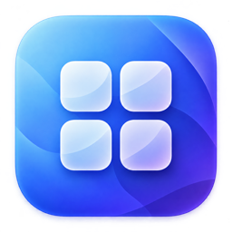
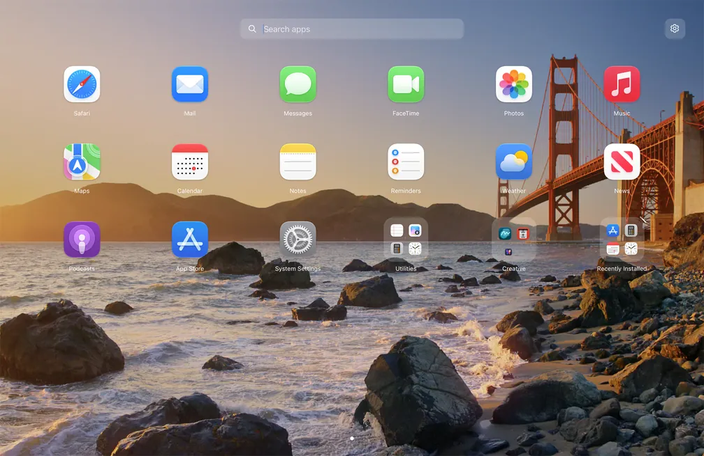
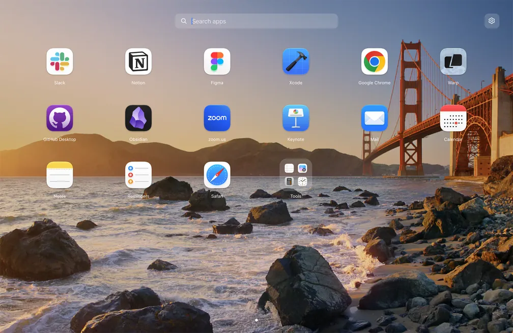
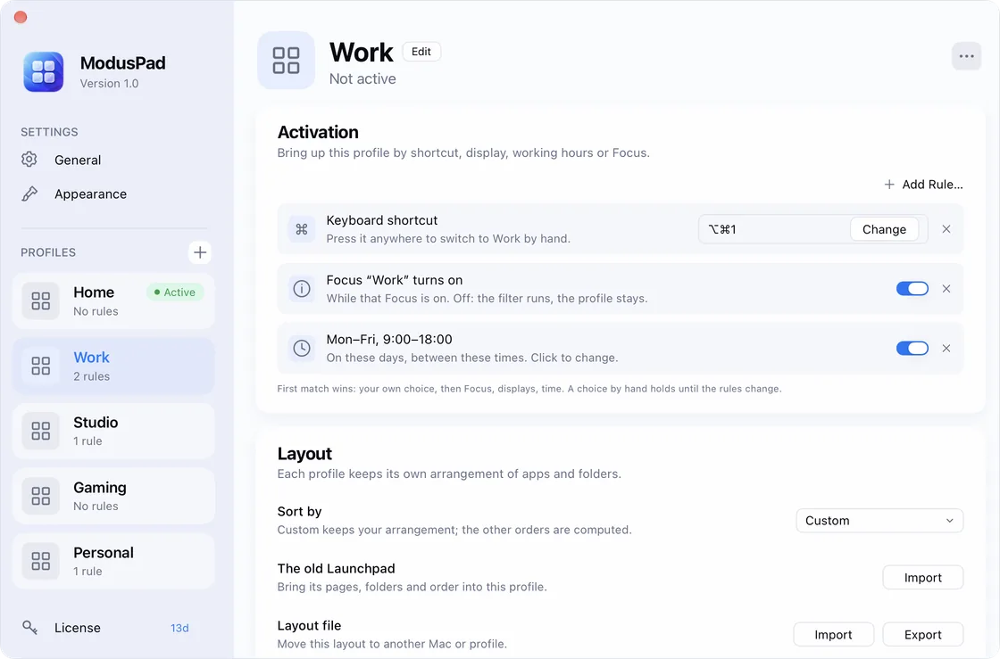

  

<h1 align="center">ModusPad</h1>

  <b>Your Mac adapts to what you're doing.</b> 
  The Launchpad you lost — plus profiles that switch your apps and launcher layout by Focus, display or time.

  <a href="https://moduspad.com/download?utm_source=github"><b>Download for Free</b></a> ·
  <a href="https://moduspad.com/?utm_source=github">Website</a> ·
  <a href="https://moduspad.com/changelog?utm_source=github">Changelog</a> ·
  <a href="https://github.com/VladyslavZubkov/ModusPad/issues">Report a bug</a>

  14-day free trial · No credit card required 
  Requires macOS 26 or later · Signed & Notarized by Apple

  

## Why ModusPad

macOS 26 replaced Launchpad with an app list: no pages, no folders, no order of your own. ModusPad brings the full-screen
launcher back — and goes further. Your Mac is a different place at 9 a.m. with an external display than on a Saturday
evening, so ModusPad lets each part of your day have its own launcher and its own apps, and switches between them by
itself.

## Features

- **A full-screen launcher, back where it belongs.** Pages, folders, search and drag & drop. Bring over your old Launchpad
  layout in one click.
- **Profiles for every kind of work.** Work, Personal, Gaming: each profile has its own launcher layout, its own hidden
  apps and the apps it opens — and runs your shortcuts from the Shortcuts app when it turns on or off.
- **Switches by itself.** Turn a profile on by schedule, when a display is connected, or when a Focus mode starts — or
  give it its own keyboard shortcut.
- **Smart folders.** Folders that fill themselves by your rules: name, category, version, architecture, when an app was
  installed or last opened, how often you launch it.
- **Open it your way.** A hotkey, F4, a hot corner, the notch or a trackpad gesture.
- **Native and private.** Built in Swift for macOS 26 and 27, in English, Deutsch, Français and 日本語. No account, no
  tracking — your layouts stay on your Mac. ModusPad never deletes or moves anything on disk.

  
  

## Install

1. [Download ModusPad](https://moduspad.com/download?utm_source=github) (a notarized DMG).
2. Open it and drag **ModusPad** to **Applications**.
3. Open ModusPad — the setup takes about a minute.

ModusPad updates itself. Homebrew: coming to the official cask.

## Pricing

Try every feature free for 14 days. Then a one-time purchase for 1, 2 or 5 Macs —
[see prices](https://moduspad.com/#pricing). After the trial, ModusPad keeps working with some limitations —
[see what changes](https://moduspad.com/after-trial?utm_source=github).

## Feedback

Found a bug or have an idea? [Open an issue](https://github.com/VladyslavZubkov/ModusPad/issues/new/choose) or write to
[support@moduspad.com](mailto:support@moduspad.com).

---

This repository holds the public page, releases and issue tracker of ModusPad. The app is closed source.
© 2026 Vladyslav Zubkov · [Terms](https://moduspad.com/terms) · [Privacy](https://moduspad.com/privacy)
